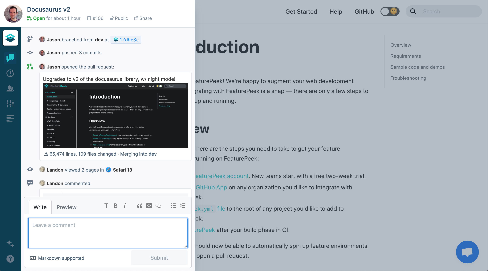

New business rarely walks through the door unannounced.

Instead, new business is won in the weeks spent preparing, pitching, and planning for a project, long before you write a single line of code. 

But that doesn’t mean you’re off the hook once a client signs. While planning and design phases are important to ensuring project success, it's the handoff experience of staging, deployment, and pull request or PR reviews that ultimately determine the client’s experience with your agency.

This has led some agencies to assemble bespoke deployment preview solutions in-house. For example, developer Conor Davidson ([@conordavidson](https://github.com/conordavidson)) explains that the team at [Sanctuary Computer](https://www.sanctuary.computer/) “built something like [FeaturePeek](https://featurepeek.com/) for our company. Easily previewing PRs has become an essential part of our workflow. [But] we switched over to FeaturePeak from our own software and are not looking back. Y’all built exactly what we wanted, plus more.”

Whether you’re determined to build in-house, or you’re interested in a complete solution like [FeaturePeek Teams](https://featurepeek.com/product/teams), it’s critical to establish a frontend staging and deployment workflow that simplifies collaboration with your clients and builds the trust and confidence that leads to repeat business. 

Here are 7 more tips to help keep your webdev agency clients happy:

# Establish clear expectations early

Let’s say you've been introduced, referred, or otherwise connected to a new client. They explain their problem and it looks like your agency can help.

Before you jump into the project, start by laying the foundations for an effective client-agency relationship by aligning expectations from day one. This is also incredibly useful when working with existing or past clients, who may be trying a new style of project with you or working to a different time frame.

Think about onboarding new clients by **creating an 'instruction manual' for working with your agency.** In other words, a how-to guide for collaborating effectively with your team. It should detail how you like to work, your expectations from clients, preferred handoff tools, your strengths, and even your weaknesses.

**Here are some helpful questions to answer in your instruction manual:**

* Who will be responsible for communicating with the client?
* How will communication be managed and recorded? Do you prefer email, telephone, or dedicated project management software?
* How do you share progress with your client?
* How do you expect feedback to be sent?
* How does your billing process work? If you charge hourly, how is work evidenced? 
* How is development managed and planned? Are you waterfall, agile, or something else? How does this benefit the client?
* Any other frequently asked questions about your working practices.

# Know your audience

Webdev agencies do complicated work and so sometimes development teams need to use technical terms to describe what is going on. But not all clients are created equal when it comes to technical competency.

It’s important to know whether you’re covering something technical with a grizzled app veteran or an untested software project neophyte. Especially for less technically-savvy clients, you should avoid unnecessary jargon wherever you can — remember your audience.

**If you must use a technical term or concept, define it immediately afterward or give a helpful analogy by relating it to something your client already knows.**

Switching to plain English, from industry-specific buzzwords and tech speak, will improve your client relationships because your contact:

* Will understand what is going on and be able to give constructive feedback
* Will be fully informed and therefore trust you
* Will have confidence in your abilities
* … and will have the language to *promote* those abilities within their professional circle.

# Be proactive and transparent

In a bad client-agency relationship, your client is constantly chasing you for updates on progress and waiting days for a reply. In a great client-agency relationship, the agency is proactive. This means frequently reaching out to your clients and keeping them updated on progress or issues.

**On-demand staging environments like [FeaturePeek](https://featurepeek.com/) simplify the collaboration process between webdev agencies and their clients.** With FeaturePeek, a floating UI overlays your deployment previews, making it easy for your reviewers to leave great feedback. Christine Kim ([@chrismekim](https://github.com/chrismekim)), another developer at Sanctuary Computer, describes “we're a team of design-oriented developers, and FeaturePeek has been an incredible tool for collaborating with designers throughout the development process. Designers can easily click on a FeaturePeek link, follow the progress of a project, and catch quality issues early on.”

# Trust your process

Your internal dev team has already established a process and culture to help your agency execute efficiently. Agencies are fast-paced, and must work on multiple projects and support several clients in parallel. So it’s no surprise that many have developed core competency in building effective internal work processes, in addition to their design and development capabilities.

That’s why it’s so important to spend time educating your client on how your team works. **Every client has different needs, but being transparent about your internal work processes can help your clients engage more effectively with your team. You’re the experts!**

Whatever your process, it’s important to reinforce agency-to-client collaboration by trusting your internal collaborative process. By continuously iterating and communicating with your clients, as you do with your own teams, you help ensure the best possible project outcome.

# Get client feedback early

Web development projects are often long and complicated, but with careful planning, you can deliver consistent value throughout the process. 

**Rather than waiting until the end of the project for a big reveal, break the project down into stages — delivering value in each.** This way, not only does the client feel supported step-by-step, they’ve also got ample opportunity to feed back in an iterative way. 

One way to ensure client feedback throughout the project lifecycle is to provide on-demand staging environments that make it easy for clients to share feedback early and often. 

Feedback delivered late is difficult (and frustrating!) to respond to. While timely feedback keeps everyone aligned, satisfied, and motivated to get the job done.

# Get business and development aligned

For many agencies, the individual or team that *won* the project, and the individual or team who *manages* the client, is often *entirely separate* from the development team. And this can be a recipe for disaster when it comes to happy client relationships.

Especially as everybody is [managing remote and distributed teams in the middle of a global pandemic](https://featurepeek.com/blog/how-to-make-your-team-still-feel-like-a-team-while-being-remote/), more than ever teams are relying on collaboration tools to keep business and development efforts aligned. **Having a single tool for visual QA that is accessible to both dev teams and non-technical users can help to keep everyone on the same page.**

For Sanctuary Computer developer Kay Mok ([@mokaymokay](https://github.com/mokaymokay)), this keeps their code reviews focused. She shares that “FeaturePeek offers a simple and convenient solution that supplements our code review process and makes visual QA much faster and easier.”

# Keep it simple

There’s a reason why product teams are so focused on the Minimum Viable Product, or MVP. That’s because **establishing a standard of minimum viability is key to ensuring your team is always working on the most important items at hand.**

In Agile, for example, simplicity means building the neatest solution that *might* meet the requirements of your client, then incrementally building upon it until your client is satisfied.

This has several benefits for client-agency relationships:
* Encourages regular feedback on work, improving communications
* Reduces time spent on potentially over-complicated solutions, reducing client spend
* Writing less code means fewer bugs, leading to less negative feedback

# Learn More

Your clients are passionate about the user experience of their projects. [FeaturePeek](https://featurepeek.com/) helps show your customers that you’re similarly passionate about the user experience you’re delivering to your agency clients. 

Choosing the right tools helps ensure consistent, effective collaboration with your clients and helps build relationships that lead to repeat business. By reflecting on the quality of your client-company dynamics, and actively working to improve them, you'll build meaningful relationships with your customers, leading to greater, more effective collaboration and further pitches and briefs in the future.

[Learn more about FeaturePeek Teams](https://featurepeek.com/product/teams), our collaborative tool that supercharges deployment previews for webdev agencies and enterprises.

**P.S. A big thank you to the super talented team at [Sanctuary Computer](https://www.sanctuary.computer/) for their help with this post!**

