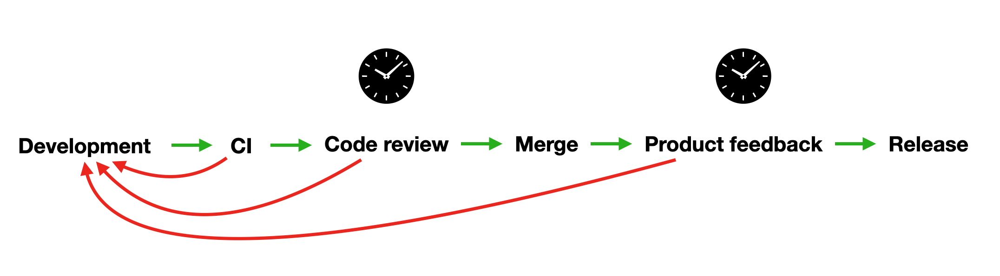
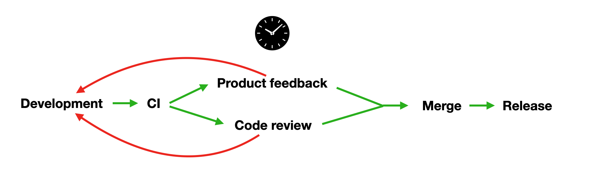

**TL;DR:** Test features in isolation. Test releases as a whole. 

You know the drill: it’s the night before a release, and your dev team is scrambling to address last-minute feedback before deploying to production. Most of the feedback surrounds tiny changes that are trivial to fix -- but some of the feedback requires larger, substantial change. These long feedback loops reveal a more fundamental issue of communication breakdown. This should have been discussed earlier. Now you’re left wondering if it’s worth delaying the release to help ensure the stability of the build.

Sound familiar? I experienced this first-hand while working at a small (~6 engineers, ~2 designers, 1 PM) B2B SaaS startup. The product team would give feedback about the latest build on staging with only a day or two left in the sprint, causing a last-minute rush by the dev team to implement those changes. Corners were cut to meet deadlines, and hastily-written workarounds were rarely refactored, adding to the backlog of technical debt as the next sprint was already underway.

If you experience these symptoms during the development of your product, then **chances are that your team doesn’t have the right tools at its disposal.** It turned out that the product team left feedback late because they *didn’t have a stable URL where they could verify UI/UX* until changes were on our staging server.

We needed a way to get stakeholder feedback earlier in the development cycle -- well before features landed on staging.

## What is a staging environment?

A staging environment is a replica of your production environment. There shouldn't be any significant differences between your staging environment and your live website, with one notable exception: the staging environment is private. 

Think of staging as the ultimate quality assurance check, where you can make sure everything works in as close to launch conditions as possible. You'll catch bugs, avoid costly downtime, and give your developers the confidence to take risks. 

## How do you deploy to a staging environment?

The traditional deployment process to a single staging environment usually has four steps:

1. **The developer builds and tests** in a local environment, running on their machine.
2. Once they are satisfied with their work, the developer pushes their changes to a branch on the git repo, where they **open a pull request**. Continuous Integration runs automated tests — like linting, type checking, and unit tests — to catch any issues. If issues are found, the developer goes back to step 
3. Once Continuous Integration passes, the developer's **peers conduct a code review**. This is necessary to gain consensus among your team that the proposed changes are greenlighted to be merged into the codebase. Not only should reviewers look at the code, but they should run the code to confirm that the code operates as intended. The developer goes back to step 1 to address any feedback left by reviewers. 
4. Once the changes are deemed copacetic by automated tests and peer reviewers, the developer's branch is **ready to be merged into the main branch**. If Continuous Delivery is enabled, then merging to the main branch kicks off an automated task to **deploy the changes in the pull request to your company's internal staging server**. 

> Depending on how your DevOps team configures your git repo's webhooks, merging to the main branch may trigger additional steps. If your org follows the practices of Continuous Deployment, merging to master could roll the latest changes out to production automatically (hopefully behind a feature flag). Every DevOps team is different — check with yours to see which practice your company follows. 

## Why multiple staging environments instead of only one?

Instead of being constrained by all upcoming changes landing on a single server, you could have temporary, ephemeral environments that exist solely for the purposes of hosting the build of a given pull request. This is what we mean when we say that you should *test features in isolation*. Giving every branch in your git repo a dedicated environment is very freeing for both your developers and reviewers. 

What you might not is realize that this comes with more benefits than just testing features.

## Code review won’t block gathering product feedback

With a single staging server, your code won't be deployed until code review passes, and you won't have a link to share with other people on your team. If you want to double-check with a UI/UX designer that the animation you made is up to snuff, too bad — you're gated upon code review passing before you can Slack over a link. 

If any stages above fail (red), you have to go back to square one. This can be costly if you’ve already performed code review, a time-consuming operation.

But UI/UX designers don't care about the quality of the code — so why should code review be a bottleneck for gathering UX feedback? Ideally, you'd be able to get their opinion before asking your dev peers to give your code a once-over. That way, you'll eliminate an extra speed bump when shipping your feature. 

Ephemeral staging servers that spin up on demand allow for product feedback and code review to occur before (or at the same time) as code review. If there’s something that needs to be addressed, going back to square one isn’t very detrimental, since not much time has passed. You eliminate a speed bump by batching product feedback with code review, rather than having one be a dependency of the other.

## Prevent an integration warzone

Sure, your new feature that you've worked hard on works now — but since a single staging environment is the landing pad for your entire engineering team's upcoming changes, a developer on your team may inadvertently push code that breaks what you wrote. Even now that you have an internal link you can share with a non-technical stakeholder, **there are no guarantees that the link will continue to work**, since it is actively being integrated with!

While a single staging environment is useful for testing a release as a whole, **features should be tested in isolation**. This means that an environment's purpose should be dedicated to testing the functionality of a single feature, rather than a collection of many features. Save testing the collection of features for your QA server, after you’ve already tested each feature individually.

## Lower the barrier for running peers' code

Developers face a large amount of context switching when they are asked to review someone else's code. The process is unnecessarily interruptive, and looks something like this:

1. Stop what you’re doing 
2. Stash any unstaged changes
3. Fetch from origin
4. Checkout their branch
5. Install dependencies (and potentially restart your development server)
6. **➡️ Actually verify the new feature and provide feedback**
7. Checkout your original branch
8. Pop your git stash
9. Reinstall dependencies (and potentially restart your development server)

With on-demand staging environments, on the other hand, **the running branch is waiting for you to verify and provide feedback**. Developers can jump into the deployment preview straight from the pull request without needing to checkout files, install dependencies, restart their development server, or change anything about their local environment.

## Avoid redundant code reviews

The point of getting feedback is to make more implementation changes that address the issues raised in the feedback session. The problem is that this will require another code review! Even though the proposed changes the second time around are (hopefully) small, your reviewers will experience déjà vu because they are now going over the same lines of code for the same feature implementation.

With multiple staging environments at your disposal, you could spin up a preview environment for your designers to critique while your pull request is still open. You wouldn’t need to request a code review from your developer peers until your designer gives the thumbs up ahead of time.

## More opportunities for testing

On-demand staging environments can be configured to be accessible behind a shared URL, which unlocks a wide range of testing and quality assurance opportunities.

* **Cross-browser testing**: Ensure your product or website works perfectly on a wide range of browsers and devices.
* **Accessibility testing**: Run accessibility tests to ensure your content is accessible to individuals with disabilities.
* **User testing**: Create a pool of test users or use a crowd-testing platform to discover usability issues before you launch.

## Avoid environment drift

Single staging environments are often configured once and left to decay, becoming a DevOps chore. This leads to drift between the staging and production environments, as similarities between the two decrease. **This increases the risk of bugs appearing in either staging or production**, which makes bugs difficult to reproduce. 

Examples of these drifts include:

* Environment and configuration files getting modified by unsuccessful staging deploys, leading to extraneous or incorrectly named settings.
* Time-sensitive security vulnerability updates being applied to production in a rush, leaving staging several versions behind.

Whereas your production environment is under constant care and attention from the DevOps team, an infrequently used staging environment is lower on the priority list.
This can lead to an unreliable staging environment, which blocks your development team from launching new features.

## More stakeholder engagement

In the past, stakeholders didn’t get to use the finished product until it was live. Instead, they got a brief scripted demo at the end of the sprint.

By giving stakeholders access to your staging environment, they can help with the quality assurance process and ensure that the development work completed meets their expectations. This saves time and prevents mistakes from accidentally shipping.

## Increased developer productivity

With on-demand staging environments, developers can create as many staging environments as they require without asking DevOps to configure a new environment. Developers love it because they have the capability to spawn new servers, and DevOps loves it because they don’t need to field manual tasks of spinning up a server only for it to be taken down shortly afterwards. 

## Save your company time and money

Single staging environments are typically available 24/7 on a dedicated server or virtual machine. This is a waste of resources that could otherwise be used for production.

Furthermore, if you have several development teams, the **single staging environment can become a bottleneck**. Teams must wait for a staging environment to become available, waiting for other teams' quality assurance processes to complete. This could waste days of developer productivity and encourage teams to skip straight to production, losing all the benefits of an effective staging environment. 

Each on-demand staging environment, on the other hand, is only online for the duration of the pull request. When the PR gets merged or closed, the environment gracefully shuts down, so you only pay for what you use.

## Single vs. on-demand staging environments

Instead of the single staging environment decaying while it waits for someone to use it, **an on-demand staging environment is created dynamically, triggered by a CI/CD pipeline**. 

This means developer teams can have access to staging whenever they need it, simply by opening a pull request. As you’d imagine, this boosts productivity and encourages developers to use staging environments, reducing the chances of costly production bugs. Once a developer is done with the staging environment, the staging environment is destroyed, along with any configuration, environment, or installation inconsistency. 

|                                                | **Single staging environment** | **On-demand staging environments**              |
| ---------------------------------------------------- | ------------------------------ | ----------------------------------------------- |
| Developer self-serve                                 | ❌                             | ✅                                              |
| Low maintenance                                      | ❌                             | ✅                                              |
| Prevents redundant code reviews                      | ❌                             | ✅                                              |
| Can test features in isolation                       | ❌                             | ✅                                              |
| Can link to a build while pull request is still open | ❌                             | ✅                                              |
| Number of environments                               | 1                              | Unlimited                                       |
| Cost                                                 | Pre-allocated                  | Allocated on demand and reclaimed automatically |

Having said that, **you should still have a staging server where you can do QA before rolling to production**. This is where you should do a final spot-check to ensure that everything is working as expected before going live. The difference is that the purpose of this server is to test the release as a whole, rather than each feature on its own. How do the new features operate together? If there’s a bug found, which pull request and which lines of code introduced the bug? These questions are much easier to answer when features are tested while the pull request is still open.

## Shorten cross-functional feedback loops with on-demand staging environments

As a front-end developer, being able to dynamically create a dedicated environment for an unlimited number of branches is a very powerful feeling. I can control my own network of machines without needing to ask for cycles from DevOps! The asynchronous nature of asking for feedback on a fleet of ephemeral environments is liberating -- I know that each deployment will be waiting for my reviewer exactly how I left it. And while I review my peers’ code, I can visually review the build alongside it without having to check out their branch locally. 

It’s not only helpful to the developers on my team, but also helpful to the non-technical stakeholders too -- they get a lens into the engineering process, and can voice their opinions while the implementation details are still fresh in the developer’s mind. 

If your organization is struggling with shipping features (on time) that meets everyone’s acceptance criteria, the solution may lie in tooling. Notice where and when the speed bumps occur -- handoff, development, code review, etc -- to help identify bottlenecks. Ask yourself whether your single staging server is a limiting factor during your team’s development processes. 

## Learn more 
The easiest way to set up on-demand frontend staging environments is with [FeaturePeek.](https://featurepeek.com) FeaturePeek creates a deployment preview of your frontend every time you open a pull request. A drawer overlay is added on top that **makes it easy for your reviewers to leave feedback** by allowing them to leave comments, take screenshots with annotations, capture screen recordings, create tickets on popular bug-tracking platforms, and more.

FeaturePeek works with static sites and sites containerized with Docker. Best of all, you don't have to migrate to a new cloud ecosystem. Whether your company's website is hosted on AWS, Google Cloud, Heroku, Digital Ocean, whatever — since FeaturePeek is infrastructure-agnostic, **you can use FeaturePeek no matter who your hosting provider is**.

Try the [2-week free trial](https://dashboard.featurepeek.com) to see how FeaturePeek can improve your team's development productivity.