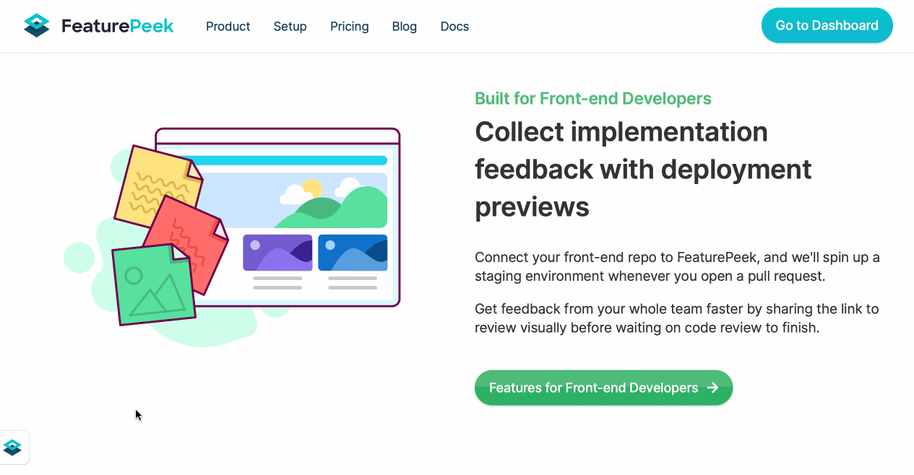
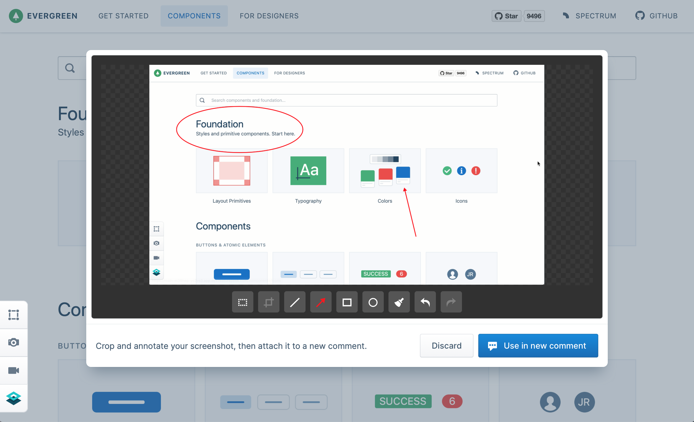
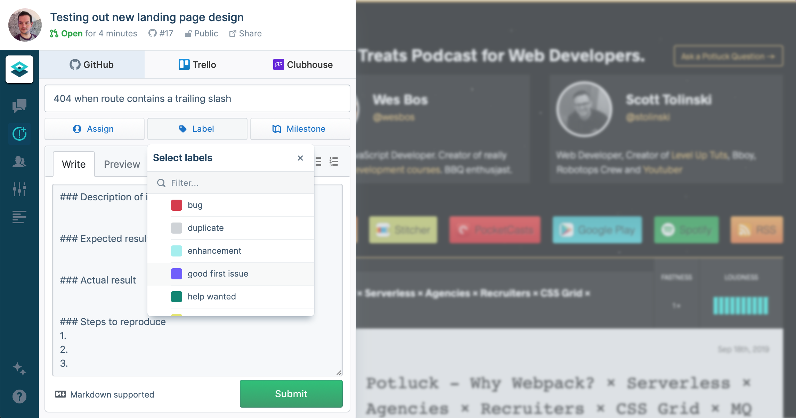

Today, we are excited to announce a major milestone in our company's mission to shorten feedback loops for teams. We have raised **$1.8 million in seed funding** led by [Matrix Partners](https://www.matrixpartners.com/) and a select group of Angel investors. We are thrilled with this partnership, and are thankful to have the support of these fantastic investors as FeaturePeek helps provide the missing link in the frontend review process.

We started FeaturePeek in 2019 to solve a real-world problem that we felt while collaborating with product and design teams: **scrambling at the last minute to integrate last-minute feedback** into releases. By developing FeaturePeek and talking with our users, we know that teams need seamless tools earlier in the dev cycle to give effective feedback on frontend implementations. Unblocking stakeholders and shortening this feedback loop allows product, design, and engineering to save time and ship higher quality releases.

Along with our funding, **we are announcing a new product** that we can't wait for you to use.

# 👩‍💻 FeaturePeek Indie 👨‍💻

We are excited to launch a new entry-level product, [FeaturePeek Indie](/product/indie). This command-line tool is the easiest way to try FeaturePeek's deployment previews, without needing to setup a CI pipeline or install a GitHub app. Best of all, it's **completely free.** We're eager for developers to try this so they can easily share and get feedback on their work. Install the CLI with homebrew: `brew install featurepeek/tap/peek` .

# FeaturePeek Teams

Our original solution that fits into your Continuous Integration pipeline is now known as [FeaturePeek Teams](/product/teams). **It's the easiest way to explore the benefits of deployment previews without having to switch infrastructure.** We've been busy listening to your feature requests — here are just a few that we've released in the last couple of weeks.

## 👨‍🎨 Unified drawer UI

The unified drawer brings new functionality and improved UX. Comments, page views, issues, and more are all presented together in a timeline view. You can file tickets to your connected integrations here, too.

## 📸 Crop and annotate screenshots

You can now crop and annotate screenshots right from your deployment preview and easily attach it to a comment.

## 🐛 File tickets with third-party integrations

You can now connect your Trello boards and Clubhouse projects to FeaturePeek and file new issues from the FeaturePeek drawer. Do you have suggestions for what issue tracking service to integrate with next? [Let us know.](mailto:hello@featurepeek.com)

# What's next

With this funding round, we are able to bring FeaturePeek Teams and FeaturePeek Indie to market, and expand our presence in the developer community. These products represent big first steps as engineering tools made for working closer with design and product teams. Thank you so much for your support — we look forward to hearing how your team likes FeaturePeek.

# What is FeaturePeek?

FeaturePeek creates **supercharged deployment previews** of your web frontend that you can share to quickly get feedback on your implementation in progress. **A drawer overlay is added on top of your site** that makes it easy for your reviewers to take screenshots with annotations, capture screen recordings, leave comments, create tickets on popular bug-tracking platforms, and more. **You get this functionality just by deploying to FeaturePeek** — no dependencies or code changes are needed. [Sign up for a free trial today. ](https://dashboard.featurepeek.com/login)
