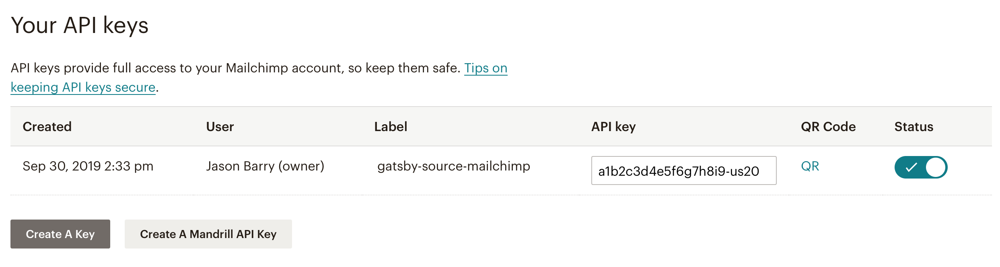

Publishing your marketing newsletters on your website is a great way to increase the amount of content available on your domain automatically. We do this here at [FeaturePeek](https://featurepeek.com) – we publish our Product Update newsletter publicly so that each campaign can be forever preserved in the archives ([here's an example](https://featurepeek.com/product-updates/0f4fe58662)). We'll show you how to do the same in this article.

The content is already written – _don't let it only be accessible via email inbox!_ The good news is that this is fairly trivial to set up if you're building a static site with [Gatsby](http://gatsbyjs.org).

Immediate benefits:

- **Improve SEO**: Importing from Mailchimp as a source means that the content lives on your domain (we're not talking about just embedding an iframe) so you can get all the SEO juice for the keywords you use in your email marketing.
- **Reduce newsletter churn**: Give your readers an opportunity to preview the content of the newsletter they're signing up for by having the content available to read on your website. Your subscribers will be less likely to unsubscribe when they can see samples of what you've sent out in the past.

> **Code sample:** Our entire marketing site is open source, so you can see this code in action by [visiting our repo](http://github.com/featurepeek/marketing-website).

## Install dependencies

We'll be adding the [gatsby-source-mailchimp](https://www.gatsbyjs.org/packages/gatsby-source-mailchimp) build-time dependency to do most of the heavy lifting for us here.

Since we only want a subset of each campaign's HTML source (we don't need the `<head>` tags from Mailchimp, for example), we'll also need a DOM parsing library. We'll be using [cheerio](https://www.npmjs.com/package/cheerio) in this article, but you can swap it out for another if you'd like, as long as it's compatible with Node.js (the native [DOMParser](https://caniuse.com/#feat=xml-serializer) would be ideal, but it's only available to browsers).

```bash
yarn add gatsby-source-mailchimp cheerio
```

## Create a Mailchimp API key

After logging in to [Mailchimp](https://login.mailchimp.com/), click your avatar in the top right and then click Account in the resulting dropdown menu. From there, click on Extras > API keys.

Click the "Create A Key" button to generate a new API key.



You should rename the Label while you're at it so that you and your teammates know what the key is correlated with – we named ours `gatsby-source-mailchimp`.

## Save the Mailchimp API key as an environment variable

We'll want to save the API key as an environment variable so that we don't check the value into version control. Anyone can read or write data to/from your Mailchimp account with this API key, so you want to make sure that you're careful with it.

You probably have a `.env.development` and/or `.env.production` files in your project root if you initially followed [Gatsby's docs](https://www.gatsbyjs.org/docs/environment-variables/#defining-environment-variables) – these gitignore'd files contain your project's environment variables. Save a new line in them with the following:

```raw
MAILCHIMP_API_KEY=<YOUR_KEY_GOES_HERE>
```

Don't forget to add this value to your servers and continuous integration platforms, as your build won't build correctly without it.

## Configure the Gatsby plugin

Tell Gatsby that you'd like to use the `gatsby-source-mailchimp` plugin in your `gatsby-config.js` file. This will read from the `MAILCHIMP_API_KEY` environment variable that you defined earlier.

```jsx
// gatsby-config.js
module.exports = {
  plugins: [
    // ...
    {
      resolve: "gatsby-source-mailchimp",
      options: {
        key: process.env.MAILCHIMP_API_KEY,
        // replace `us20` with the value in your Mailchimp dashboard URL
        rootURL: "https://us20.api.mailchimp.com/3.0"
      }
    }
    // ...
  ]
}
```

## Create the CampaignPost template component

This component will be what renders when someone loads an individual campaign post page. You might recognize the format of this component if you followed any of the Gatsby blog starters – it's very [similar to the BlogPost template component](https://github.com/DSchau/gatsby-blog-starter-kit/blob/master/src/templates/blog-post.js). 

We'll be checking that `status === 'sent'` and `post.send_time !== 'Invalid date'` in order to prevent accidentally publishing draft campaigns that haven't been sent out yet.

```jsx
// src/templates/CampaignPost.js
import React from "react"
import { graphql, Link } from "gatsby"
import cheerio from "cheerio"

import Layout from "components/Layout"
import SEO from "components/Seo"

export default function CampaignPost(props) {
  const post = props.data.mailchimpCampaign
  const siteTitle = props.data.site.siteMetadata.title
  const { previous, next } = props.pageContext

  // we don't want the full post.html -- just what is in the body container
  
  const $ = cheerio.load(post.html)
  const bodyTable = $('.bodyContainer').html()

  return (
    <Layout title={siteTitle}>
      <SEO
        title={post.settings.title}
        description={post.settings.preview_text}
      />
      <div style={{ margin: 'auto', maxWidth: 600 }}>
        <Link href="/product-updates">← All product updates</Link>
        <h1>{post.settings.title}</h1>
        {post.send_time !== 'Invalid date' && <p>{post.send_time}</p>}
      </div>
      <div id="campaign" dangerouslySetInnerHTML={{ __html: bodyTable }} />
      <ul>
        <li>
          {previous && previous.status === 'sent' && previous.settings.title && (
            <Link href={`/product-updates/${previous.campaignId}`} rel="prev">
              ← {previous.settings.title}
            </Link>
          )}
        </li>
        <li>
          {next && next.status === 'sent' && next.settings.title && (
            <Link href={`/product-updates/${next.campaignId}`} rel="next">
              {next.settings.title} →
            </Link>
          )}
        </li>
      </ul>
    </Layout>
  )
}

export const pageQuery = graphql`
  query CampaignPostById($slug: String!) {
    site {
      siteMetadata {
        title
        author
      }
    }
    mailchimpCampaign(campaignId: { eq: $slug }) {
      html
      settings {
        preview_text
        subject_line
        title
      }
      campaignId
      send_time(formatString: "MMMM DD, YYYY")
      status
    }
  }
`
```

## Create ProductUpdates page component

This page serves as the collection page for all of your campaigns. In this example, it'll be served from the `/product-updates` route.

```jsx
// src/pages/product-updates.js
import React from "react"
import { graphql, Link } from "gatsby"

import Layout from "components/Layout"
import SEO from "components/Seo"
import JoinMailingList from "components/JoinMailingList"

const reverseChronologically = (a, b) => 
  new Date(a.node.send_time) < new Date(b.node.send_time) ? 1 : -1

export default function ProductUpdates(props) {
  const { data } = props
  const siteTitle = data.site.siteMetadata.title
  const campaigns = data.allMailchimpCampaign.edges

  return (
    <Layout title={siteTitle}>
      <SEO title="All product updates" />
      <h1>FeaturePeek product updates</h1>
      <JoinMailingList />
      <h2>Archive</h2>
      {campaigns
        .sort(reverseChronologically)
        .map(({ node }) => {
          const title = node.settings.title
          return (
            <div key={node.campaignId}>
              <small>{node.send_time}</small>
              <h3>
                <Link href={`/product-updates/${node.campaignId}`}>{title}</Link>
              </h3>
              <p>{node.settings.preview_text}</p>
            </div>
          )
        })
      }
    </Layout>
  )
}

export const pageQuery = graphql`
  query {
    site {
      siteMetadata {
        title
      }
    }
    allMailchimpCampaign(
      filter: { 
        status: { eq: "sent" }, 
        settings: { 
          title: { ne: "" } 
        } 
      }
    ) {
      edges {
        node {
          settings {
            preview_text
            subject_line
            title
          }
          campaignId
          send_time(formatString: "MMMM DD, YYYY")
          status
        }
      }
    }
  }
`
```

## Extend createPages

Finally, we need to create the graphQL query to pull the data from the Mailchimp source.

If your Gatsby project already contains a blog, your `createPages` method in `gatsby-node.js` is probably already in use. You'll need to combine what you already have with what is written in detail below in order to iterate over both your blog posts and Mailchimp campaigns. 

```jsx
// gatsby-node.js
exports.createPages = ({ graphql, actions }) => {
  const { createPage } = actions
  const CampaignPost = path.resolve(`./src/templates/CampaignPost.js`)

  return graphql(`
    {
      allMailchimpCampaign {
        edges {
          next {
            campaignId
            settings {
              preview_text
              subject_line
              title
            }
            status
          }
          previous {
            campaignId
            settings {
              preview_text
              subject_line
              title
            }
            status
          }
          node {
            html
            settings {
              preview_text
              subject_line
              title
            }
            campaignId
            send_time
            status
          }
        }
      }
    }
  `).then(result => {
    if (result.errors) {
      throw result.errors
    }

    // Create product update pages
    const campaigns = result.data.allMailchimpCampaign.edges

    campaigns.forEach((campaign, index) => {
      const previous =
        index === campaigns.length - 1 ? null : campaigns[index + 1].node
      const next = index === 0 ? null : campaigns[index - 1].node

      createPage({
        path: `/product-updates/${campaign.node.campaignId}`,
        component: CampaignPost,
        context: {
          slug: campaign.node.campaignId,
          postPath: `/product-updates/${campaign.node.campaignId}`,
          previous,
          next,
        }
      })
    })

    return null
  })
}
```

## Rejoice in the glory of automation

That's all there is to it! Now the next time you rebuild your site, your campaigns will be pulled from Mailchimp and built as static HTML pages. You can [check out how ours look here](https://featurepeek.com/product-updates).


Remember, the source only gets queried at build time – so when you mail out a new newsletter, you'll have to rebuild your Gatsby site to pick up the content and publish on your website.

## Thanks for following along!

One closing note: While I was writing this article, I verified that the code samples worked as expected by building the deployment preview of this blog post on [FeaturePeek](https://featurepeek.com). It was super useful to confirm that the whole idea behind was behaving correctly on a server besides my local machine.

We use FeaturePeek on featurepeek.com (meta) to iterate faster during development. Our blog (and entire marketing site for that matter) is open source on GitHub, so you can take a peek at the preview environments that deploy on [our open pull requests](https://github.com/featurepeek/marketing-website/pulls). 