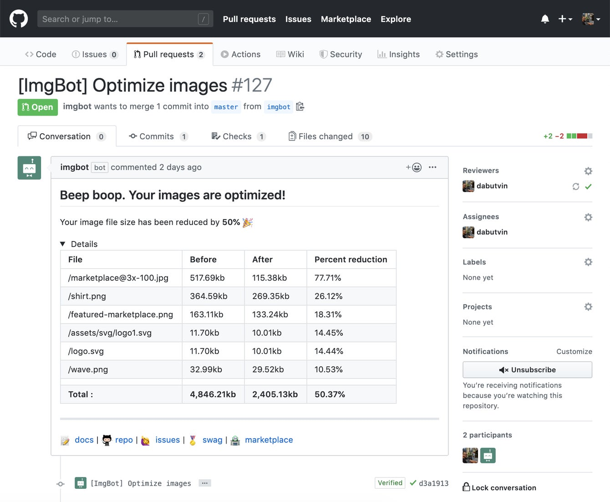

We love great code reviews. They dramatically improve the quality of your code, which ultimately means better and more reliable products.

What we _don’t_ love about code reviews is how long they take, with many pull requests being painfully slow to approve. We shared a few tips to [speed code reviews up here](/blog/why-are-so-many-orgs-slow-to-approve-pull-requests/), but another big factor is having the right _tools_ for the job. 

In this article we'll share some of the best tools we've used during the code review process. Many of the tools listed here are available through the [GitHub Marketplace](https://github.com/marketplace), and we've given the pros and cons of each one below. 

## AccessLint

How accessible is your software? 

Chances are, you probably don’t know for sure. The sad truth is that while web accessibility standards are well documented, they’re rarely part of the code review process.

That’s why we love [AccessLint](https://github.com/marketplace/accesslint), which automatically runs a series of accessibility tests and comments on your pull request with easy suggestions to resolve them. This includes major accessibility features, as well as those that benefit those with temporary conditions (like a broken arm) or more minor ailments (like bad eyesight).

If you’re not already on your accessibility, you really need to be. In many countries, this is now a legal requirement. 

In the US, there have been various lawsuits against inaccessible websites that do not comply with ADA guidelines. In the UK, web accessibility is protected by the Equalities Act.

- **Pros:**
  - Gives instant WCAG 2.0 accessibility feedback for common accessibility issues
  - Available through GitHub Marketplace, so can be added instantly
- **Cons:**
  - Not a comprehensive review and only covers basic issues
  - Limited file type support (Haml, HTML, ERB/Rails)
- **Pricing:**
  - Free for all open-source public projects
  - Free for educational institutions for public and private projects
  - $49/month for unlimited public and private projects

## Imgbot

When you are focused on shipping code and reaching deadlines, it's easy to forget to optimize images. 

But smaller images mean a better experience for your users, with fast load times, higher conversion rates and reduced bandwidth costs. So it’s really important not to overlook this. 

[Imgbot](https://imgbot.net) is a simple tool that handles losslessly compressing all the images in your repositories. There’s no fancy stuff going on here, just a super simple and mega effective tool to cover off this specific review necessity.

- **Pros:**
  - Automatically optimizes images losslessly, but can be set to more aggressive compression if required
  - Once set up, no interaction is required - just approve the incoming merges.
- **Cons:**
  - Pricing is high for small teams 
  - Would love to see support for video files in future
- **Pricing:**
  - Free for open source projects
  - $10 per month for personal projects
  - $30 per month for professional projects

## LGTM

[LGTM](https://lgtm.com) is a code analysis platform that focuses on finding 0-days (an unaddressed software vulnerability) and preventing critical issues in your product.

If an issue is detected by their 1600+ analyses, it is automatically flagged on the pull request to be resolved or mitigated.

Their security analysis is unparalleled in the industry, with a dedicated team of security researchers who have found [107 CVEs](https://lgtm.com/security) to date in high-profile projects like UBoot, Apache Struts, the Linux Kernel, Memcached, VLC, and Apple's XNU.

Example issues detected includes regular expression injection, XSS detection, and poor code quality leading to security issues.

- **Pros:**
  - Wide support for programming languages, including C, C++, Java, Javascript, and Python
  - High level of detection of vulnerabilities and important code problems
- **Cons:**
  - No Go support - try Deep Source below for this

## DeepSource

Used by companies like NASA, Uber, and Slack, [DeepSource](https://deepsource.io) detects documentation coverage issues and security vulnerabilities automatically.

Example issues detected include:

*   If you use a module but fail to include it in your requirements management
*   Static Application Security Testing (SAST) issues
*   Sensitive information committed to the repository instead of a private environment file

DeepSource automatically adds annotations and comments to pull requests, making it easy to see issues and ensure good security code. This makes the _entire_ code review process quicker and ensures higher code quality across the project.

- **Pros**:
  - Gives instant security feedback in a friendly way
  - Easy-to-use web interface
- **Cons:**
  - Limited to Python and Go
- **Pricing:**
  - Free for all open-source public projects
  - For private projects, from $12 per month

## Codelingo

Once you've set standards for code quality, you need to check that they are being met. Most teams use a generic linter to do this, but there is a better way.

Enter [Codelingo](https://www.codelingo.io) — this tool allows you to define and check your rules programmatically in a codelingo.yaml file. 

The main advantage of Codelingo over generic code quality tools is that you can flexibly write rules that actually work for _your team,_ rather than being limited by a generic linter.

Should the rules not be met in a pull request, Codelingo automatically comments on the pull request and notifies the contributor to be fixed. Simple.

- **Pros:**
  - Can define bespoke code quality rules 
  - Automatically resolves minor code quality issues
- **Cons:**
  - Only supports PHP, Python, Go and C#
- **Pricing:**
  - Generous free plan for public repositories
  - $15/month per organization member, with assistance to write rules for your most significant issues

## DeepScan

[DeepScan](https://deepscan.io) is an advanced static analysis tool that supports JavaScript, TypeScript, React, and Vue.js.

It automatically identifies possible runtime errors and potential quality issues, going beyond what ESLint can do by truly understanding the data-flow of your entire application.

DeepScan also provides helpful metrics on team member performance and how closely they follow code standards, helping managers provide constructive feedback. 

We also love their grading system, which assigns your projects a simple grade of either "Poor", "Normal", or "Good".

- **Pros:**
  - Specialist tools for JavaScript, TypeScript, React, and Vue.js projects
  - A simple grading system for feedback
- **Cons:**
  - Limits on language and library support 
- **Pricing:**
  - Free for open source projects
  - From $15.96 per seat per month

## CodeScene

[CodeScene](https://empear.com) is a behavioral code analysis tool that analyzes behavioral data as recorded in version-control systems. This lets CodeScene uncover both organizational information such as knowledge distribution, inter-team coordination bottlenecks in code, as well as prioritizing technical issues based on the estimated return on investment if the findings are addressed. 

- **Pros:**
  - Explore the efficiency of your organization with respect to Conway’s Law.
  - Detect sub-systems with low team autonomy that become productivity bottlenecks.
  - Measure the technical risk when a key developer leaves the project.
- **Pricing:**
  - Analyze up to 5 projects for free
  - Unlimited git repos in analyses starts at $249/month

## FeaturePeek 

Before we go, there is one more tool for your consideration &mdash; our very own [FeaturePeek](https://featurepeek.com).

One of the most tedious parts of the code review process is running your peers' branches locally to confirm that their code works as expected. 

The truth is, many times this step simply just gets skipped. And non-technical stakeholders (such as a designer or a product manager) with no knowledge of git or front-end development *definitely* don't do it.

With **automated deployment previews for every pull request**, reviewers can see the code working, just by clicking a link, before any code gets merged into the default branch. 

What sets FeaturePeek apart from other deployment preview services? **FeaturePeek overlays collaboration tools on top of every environment to empower your reviewers leave great reviews**. The collaboration tools include commenting, filing new issues with bug templates, screen recording, pixel measurement, and more. This functionality comes standard just by deploying to FeaturePeek &mdash; no modifications to your front-end stack required.

Like all the tools in this blog post, FeaturePeek plugs into GitHub seamlessly, so getting up and running just takes a few minutes. 

[You can try FeaturePeek for free for 14 days by creating a new account here.](https://dashboard.featurepeek.com/login)

- **Pros:**
  - Ephemeral, on-demand deployment previews for every front-end pull request
  - Floating widget on every preview makes it easy for your team to leave feedback
  - Hosting provider / PaaS agnostic, works with static and dockerized front-ends
- **Cons:**
  - Let us know if you can think of any!
- **Pricing:**
  - Free for public repos
  - $19/user/month for private repos ($16/user/month for annual commitment)
