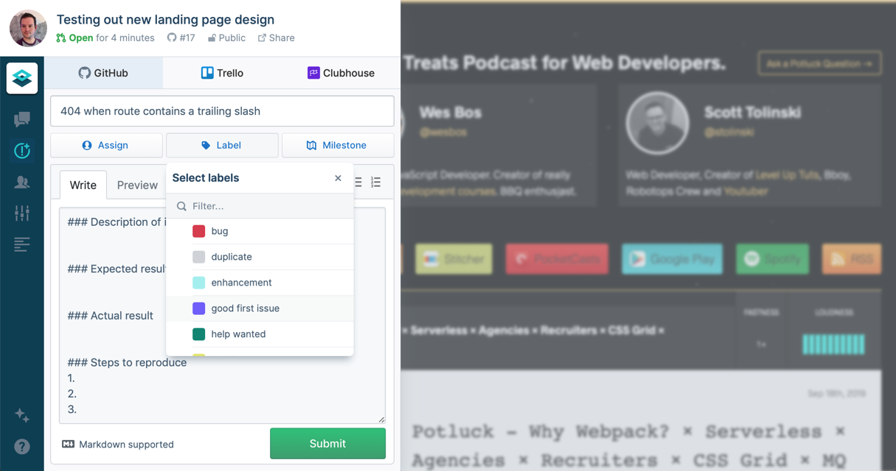

Let’s be honest, frontend developers kinda had this remote working thing figured out before our latest post apocalyptic reality. Now, it’s still been difficult for us all to adjust. But if there were any demographic that already had the know-how and the tools to stay productive while collaborating remotely, frontend teams had it covered.

The challenge, most of the time, is just sorting through the overlapping options and developer-targeted Google Search ads to get to the tools that actually make your workflow easier.

Don’t worry. [At FeaturePeek, we’re devtool nuts](https://featurepeek.com/blog/the-8-best-tools-for-code-review-in-2020/). And we try out just about everything we discover. Along the way, we’ve earmarked our favorites and fully incorporated many into our regular internal workflows.

You could try out everything by yourself. Or you can learn from what our team figured out. But before we jump into our favorite little-known remote working tools, let's start by covering the basics.

## Remote Working Essentials

These are the fundamental tools every remote worker needs. Most development teams will already be using these in their day-to-day efforts, but if you skip over these fundamental tips and tricks, you'll struggle to make the most of the other tools we mention in this article.

### The Basics: Team Chat Tools

Email isn’t exactly dead, but it’s no longer the standard for asynchronous communications. Development teams have used text chat to collaborate since the internet was invented. So if you aren't using a communication tool like Slack already, adopting one should be your first step towards productive remote working as a development team.

Are there other chat alternatives? Sure. But we haven’t found any we like better than Slack yet.

Here are the key features of [Slack](https://slack.com/) that make it work for developer teams:

* **Channel Messaging:** You can create unlimited channels dedicated to tasks, projects, issues, or initiatives. For example, you could make a #webbugs channel to triage issues in your web app or a #marketingsite channel to discuss a website update. By working in a channel, you can be sure that all the right people see the right messages at the right time.
* **Searchable Knowledge:** Slack is a single place where you can find conversations and files related to your work. Never again lose an email attachment in a crowded email inbox.
* **Integrations:** Bring all the activity you care about into Slack so you never miss a thing. For example, a new Jira ticket could trigger a chat message or a new pull request to notify the right people to review it.

### The Basics: Version Control

It doesn’t matter whether you’re working remotely or not. Version control is a critical part of modern software development, for both remote and co-located teams. Whether you use [GitHub](https://github.com/), [GitLab](https://gitlab.com/), [Bitbucket](https://bitbucket.org/product), you’ve likely already adopted one that makes sense for your team.

Regardless of the platform you choose, the benefits are the same:

* **Collaboration:** Without version control in place, you are probably working in a shared directory and hoping your colleagues don't modify the files you are working on. Eventually, someone will save over your changes and you'll lose your work. With version control, you can work on any file without disrupting your colleagues. If there is a conflict, your version control system will let you merge these files later.
* **File History:** Without version control, keeping a file history is almost impossible. With version control, changes to files are automatically tracked along with a commit message (a brief description of what has changed) and you can view the history of a file whenever you like. This makes it easy to see how files have evolved and what might have caused that annoying bug.

### The Basics: Video Conferencing
I, for one, welcome our new [Zoom](https://zoom.us/) overlords. Video conferencing is inescapable in the new shelter-in-place environment. And while we’ve all suffered from Zoom fatigue at points this year, sometimes you just need to discuss a bug or issue face-to-face.

At [FeaturePeek](https://featurepeek.com/), we actually find ourselves using a few different video conferencing solutions. But if you need one platform to rule them all, Zoom is easy to use and includes features that are essential for development meetings, including screen sharing, annotations, and support for whiteboarding sessions on select plans.

Other solutions are available, including [Cisco Webex](https://www.webex.com/), [Jitsi Meet](https://meet.jit.si/), [Google Chat](https://chat.google.com/), and [Whereby](https://whereby.com/). If you pay for the Standard, Plus, or Enterprise version of Slack, you get video call capabilities, too.

## Little-Known Remote Working Tools

With the basics in place, you'll be able to chat with your team and keep track of development work. Now, let's level up your remote working productivity so you don’t skip a beat while skipping the office commute.

### Miro: Online Whiteboard 

If you’ve ever found yourself wishing that your development team could just meet for an in-person whiteboard session, [Miro](https://miro.com/) is the next best thing.

By being physically present and taking turns to write or move ideas around, it's easy to plan, share complicated ideas, and leave key information on display, such as project timelines or key tasks to be completed.

Miro brings that whiteboard online and enables remote teams to collaborate in real-time in a free-flowing and creative way — just like a real-world whiteboard.

Miro also doesn’t just try and replicate the meatspace whiteboard experience. They explored what being a digital whiteboard can enable, and it actually has some key advantages over a real whiteboard:

* **Infinite Canvas:** There are no limits to the size of the Miro whiteboard. Create a single whiteboard for every project in your company, all reviewable from one place.
* **Add Files:** You can add files from Google Docs to the whiteboard, which will be automatically updated and synced.
* **Collaboration:** All team members can make changes simultaneously from wherever they are in the world.

### Loom: Video Messaging 

At FeaturePeek, we use [Loom](https://www.loom.com/) for all kinds of our video needs. Instead of writing a long email or Slack message to explain that annoying bug, try using Loom to record a quick video instead.

We also use Loom to generate quick and dirty developer how-to videos to share later as an .MP4. Unlike normal screen recordings, Loom captures your screen, microphone, and face at the same time. This encourages users to explain their thoughts as they record; perfect for highlighting bugs or creating demos to be circulated within your team.

[Loom recently launched for iOS](https://support.loom.com/hc/en-us/articles/360002799977-Is-there-a-Loom-mobile-app-), enabling app developers to record and share issues quickly.

### FeaturePeek: Deployment Previews

*The FeaturePeek UI overlay makes it easy to file tickets to third-party apps like GitHub Issues, Trello, and Clubhouse.*

Sure, we're biased in recommending [FeaturePeek](https://featurepeek.com/). But the benefits of on-demand staging environments are huge for remote development teams: 

* **Quicker Design Feedback:** Get feedback from designers by just sending them a link. No need to manually deploy or help the designer set up a local environment. When they do give feedback, FeaturePeek automatically records the URL they are on and their browser metadata, making it easier to resolve issues.
* **Review Others Work:** Switching to a colleague's branch to review their work takes time. With FeaturePeek, every branch is a dedicated environment, instantly available for your review. 
* **Quality Assurance:** "Well it works on my machine" is a thing of the past. Get an instant preview of how your branch will work on any server.

Want to see how this could work for your team? Our entire website is open source on GitHub, so you can take a peek at the preview environments that deploy on [our open pull requests.](https://github.com/featurepeek/marketing-website/pulls)

### Headspace: Meditation

Being productive isn't just about tooling and apps. Being productive is also a state of mind. 

Sometimes a project [requires you to hype up](https://www.youtube.com/watch?v=sT2daisxdvA). But more often than not, these days you’re probably having trouble winding down.

Research shows that mindfulness can help improve mental health. And according to a [2020 study](https://www.ncbi.nlm.nih.gov/pubmed/32252750), meditation reduces stress and improves cognition. 

[Headspace](https://www.headspace.com/) is an app that aims to make meditation accessible to everyone. Taking a few moments to re-calibrate can help when development work becomes overwhelming or deadlines start to cause stress.

### When To Chat: Timezone Sync

If your team is distributed around the world, it can be impossible to figure out a mutually convenient time to meet.

With [When To Chat](https://whentochat.co/), you enter your timezone, the timezone of the person you are meeting with, and your availability. It'll automatically suggest a range of times instantly. 

If you use Slack, you can [add it to your workplace here](https://slack.whentochat.co/). Then, just type /whentochat, then @ your colleagues.  For example: /whentochat @gary @tom "Dev Meeting"

## Learn More

Let us know how your remote team stays productive by sharing with us on [Twitter](https://www.twitter.com/featurepeek) and [LinkedIn](https://www.linkedin.com/company/featurepeek/).

FeaturePeek provides collaborative frontend staging environments on-demand, so you can collect implementation feedback sooner. FeaturePeek works with all frameworks and hosting providers, so you can keep your tools and you’re never locked in.

[Learn more about FeaturePeek Teams](https://featurepeek.com/product/teams), our collaborative tool that supercharges deployment previews for development teams.